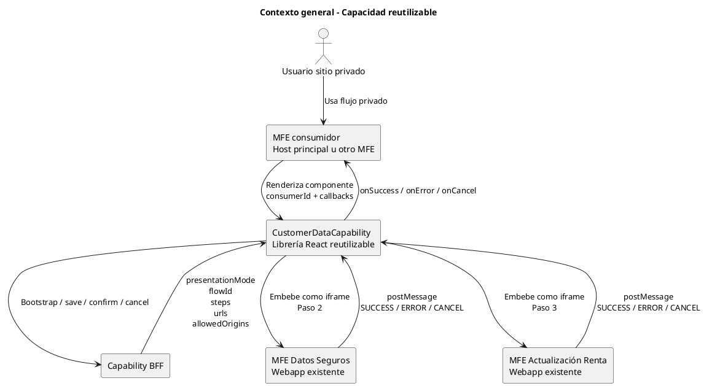
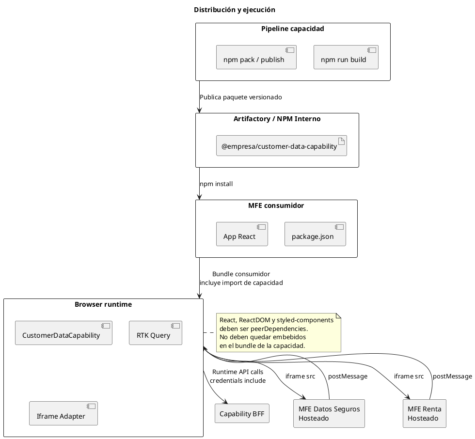
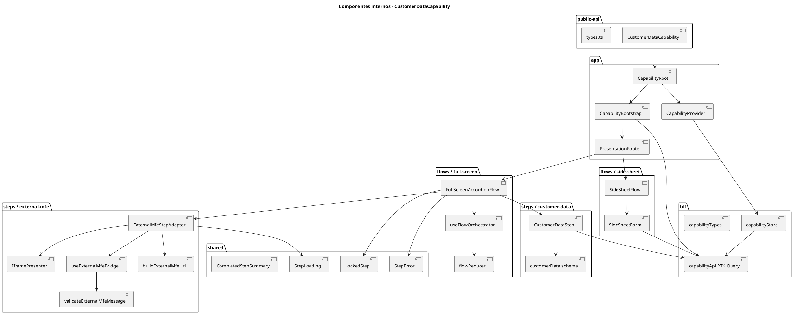
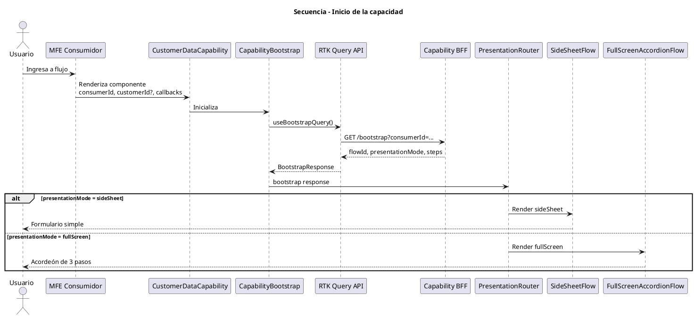
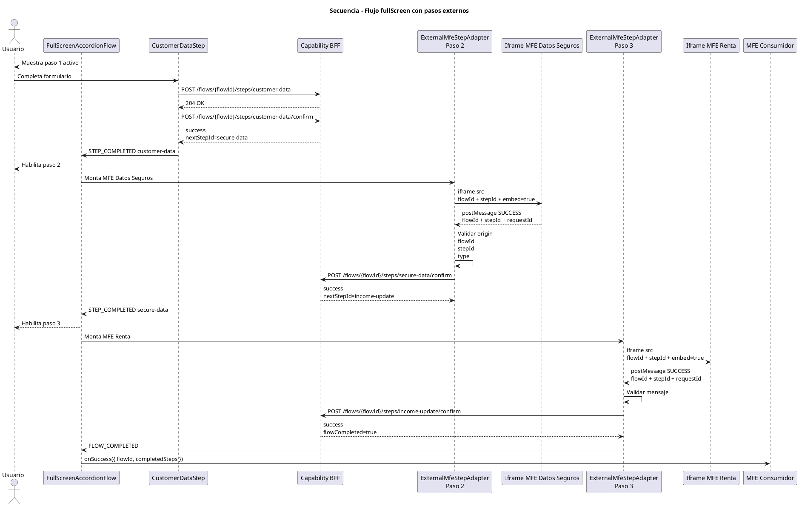
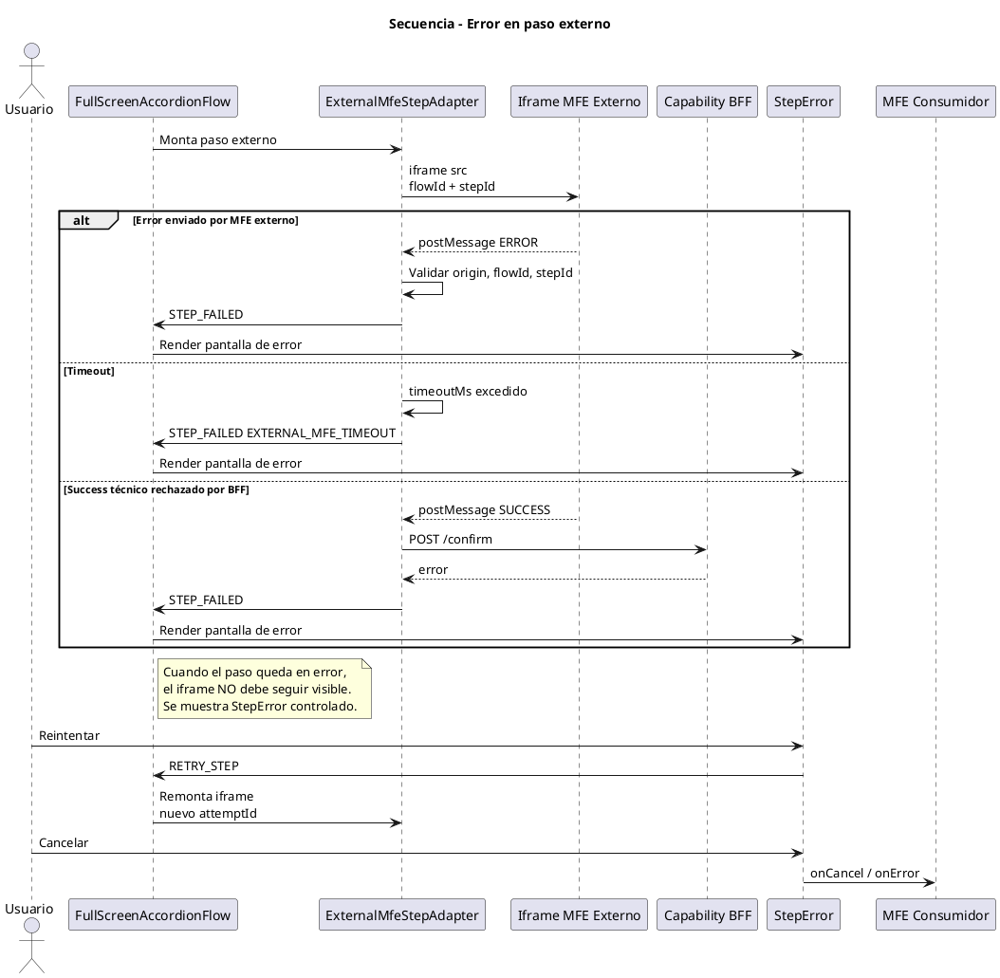
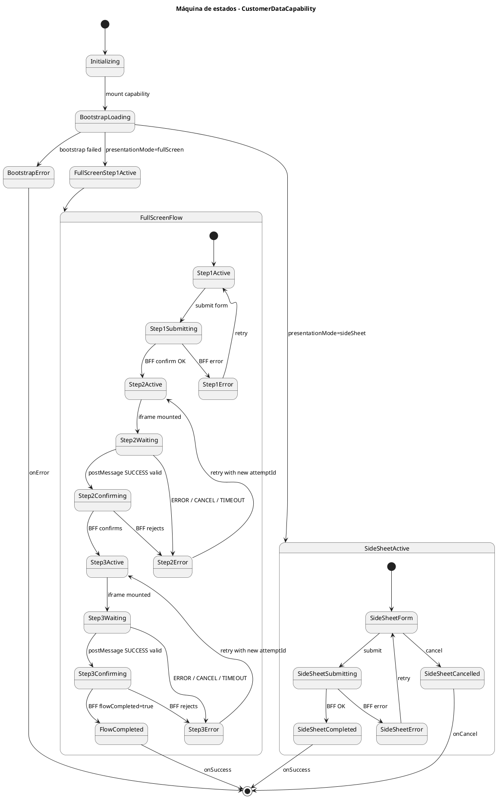
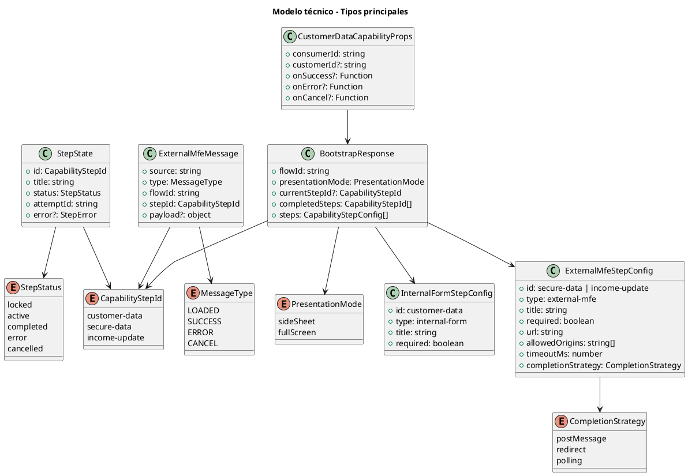

# Customer Data Capability

Capacidad reutilizable para orquestar actualización de datos de cliente dentro del sitio privado. La capacidad se distribuye como una librería React instalada desde NPM interno/Artifactory y encapsula la lógica de presentación, flujo, comunicación con BFF y orquestación de MFEs externos existentes.

> Decisión principal: la capacidad es el producto reutilizable. Los MFEs existentes de `datos seguros` y `actualización de renta` son webapps externas orquestadas mediante adapters, no componentes internos importados.

---

## Tabla de contenidos

- [Objetivo](#objetivo)
- [Principios de diseño](#principios-de-diseño)
- [Alcance](#alcance)
- [Fuera de alcance](#fuera-de-alcance)
- [Arquitectura general](#arquitectura-general)
- [Distribución](#distribución)
- [Consumo por MFEs](#consumo-por-mfes)
- [Contrato público](#contrato-público)
- [BFF de la capacidad](#bff-de-la-capacidad)
- [Flujos soportados](#flujos-soportados)
- [Estado del flujo](#estado-del-flujo)
- [Integración con MFEs externos](#integración-con-mfes-externos)
- [Seguridad](#seguridad)
- [Estructura del proyecto](#estructura-del-proyecto)
- [Dependencias](#dependencias)
- [Configuración base](#configuración-base)
- [Diagramas UML](#diagramas-uml)
- [Pruebas](#pruebas)
- [Checklist de aceptación](#checklist-de-aceptación)
- [Riesgos y mitigaciones](#riesgos-y-mitigaciones)
- [Orden recomendado de implementación](#orden-recomendado-de-implementación)

---

## Objetivo

Construir una capacidad reutilizable para distintos MFEs del sitio privado.

La capacidad debe:

1. Ser instalada como paquete NPM interno.
2. Exponer un componente React público simple.
3. Consultar su propio BFF al iniciar.
4. Decidir si renderiza `sideSheet` o `fullScreen` según respuesta del BFF.
5. Renderizar un formulario simple propio en modo `sideSheet`.
6. Renderizar un flujo fullScreen con pasos tipo acordeón en modo `fullScreen`.
7. Orquestar MFEs existentes como pasos externos.
8. Validar éxito, error, cancelación y timeout.
9. Confirmar el avance con BFF antes de abrir el siguiente paso.
10. Notificar al consumidor mediante `onSuccess`, `onError` y `onCancel`.

---

## Principios de diseño

### La capacidad controla el flujo

El host consumidor no debe conocer el detalle de los pasos internos.

Correcto:

```tsx
<CustomerDataCapability
  consumerId="mfe-home-private"
  onSuccess={handleSuccess}
  onError={handleError}
  onCancel={handleCancel}
/>
```

Incorrecto:

```tsx
<CustomerDataCapability
  secureDataUrl="..."
  incomeUpdateUrl="..."
  currentStep="secure-data"
  shouldOpenIframe
/>
```

El consumidor no debe pasar URLs, pasos, estrategias, origins ni detalles de MFEs externos. Eso lo define el BFF de la capacidad.

### Los MFEs existentes son cajas negras

Los MFEs `datos seguros` y `actualización renta` ya existen como webapps. No se deben importar como librerías, ni federar, ni reempaquetar.

Se integran como pasos externos mediante:

```txt
ExternalMfeStepAdapter + iframe + postMessage + confirmación BFF
```

### El BFF es fuente de verdad

El frontend no decide por sí solo si un paso terminó correctamente. Un `postMessage SUCCESS` es una señal técnica, no una verdad de negocio.

Flujo correcto:

```txt
MFE externo envía SUCCESS
  ↓
Capacidad valida mensaje
  ↓
Capacidad confirma con BFF
  ↓
BFF valida estado real
  ↓
Capacidad avanza o muestra error
```

---

## Alcance

La primera versión incluye:

- Paquete React distribuible por NPM interno.
- API pública mínima.
- Provider interno.
- Store interno para RTK Query.
- Bootstrap contra BFF.
- Router de presentación `sideSheet | fullScreen`.
- SideSheet con formulario simple.
- FullScreen con flujo tipo acordeón.
- Paso 1 interno: formulario de datos del cliente.
- Paso 2 externo: MFE datos seguros.
- Paso 3 externo: MFE actualización renta.
- Adapter reusable para MFEs externos.
- Comunicación mediante `postMessage`.
- Validación de `origin`, `flowId`, `stepId` y `type`.
- Timeout por paso externo.
- Confirmación de pasos con BFF.
- Pantalla de error por paso.
- Retry con nuevo `attemptId`.
- Callbacks públicos normalizados.
- Mocks con MSW.
- Tests unitarios e integración base.

---

## Fuera de alcance

No implementar en esta fase:

- Module Federation.
- Web Components.
- Shadow DOM.
- SDK Loader + Manifest remoto.
- Importación directa de bundles remotos.
- Refactor profundo de los MFEs existentes.
- Compartir Redux store con consumidores.
- Exponer configuración interna al consumidor.
- Hacer que el MFE del paso 2 invoque directamente al paso 3.
- Avanzar de paso solo por `postMessage` sin confirmación BFF.

---

## Arquitectura general

```txt
MFE consumidor
   │
   │ importa paquete NPM
   ▼
CustomerDataCapability
   │
   │ consulta bootstrap
   ▼
Capability BFF
   │
   ├── decide presentationMode: sideSheet | fullScreen
   ├── crea flowId
   ├── entrega configuración de pasos
   ├── entrega URLs de MFEs externos
   ├── entrega allowedOrigins
   └── valida avance de negocio
   │
   ▼
Capability UI
   ├── SideSheetFlow
   │     └── formulario simple
   │
   └── FullScreenAccordionFlow
         ├── Paso 1: formulario interno
         ├── Paso 2: ExternalMfeStepAdapter → MFE datos seguros
         └── Paso 3: ExternalMfeStepAdapter → MFE actualización renta
```

---

## Distribución

La capacidad se distribuye como paquete interno:

```txt
@empresa/customer-data-capability
```

El paquete contiene:

- Componente React público.
- Tipos TypeScript.
- Lógica de bootstrap.
- RTK Query API slice.
- Store interno.
- Orquestador de flujo.
- UI shell.
- Formulario interno.
- Adapter iframe para MFEs externos.
- Validación de mensajes externos.

El paquete no contiene:

- Código fuente de los MFEs externos.
- URLs hardcodeadas por ambiente.
- Tokens.
- Configuración que deba conocer el consumidor.

---

## Consumo por MFEs

Instalación:

```bash
npm install @empresa/customer-data-capability
```

Uso básico:

```tsx
import { CustomerDataCapability } from '@empresa/customer-data-capability';

export function ConsumerPage() {
  return (
    <CustomerDataCapability
      consumerId="mfe-home-private"
      customerId="optional-customer-id"
      onSuccess={(result) => {
        console.log('Capacidad finalizada', result);
      }}
      onError={(error) => {
        console.error('Capacidad falló', error);
      }}
      onCancel={(result) => {
        console.log('Capacidad cancelada', result);
      }}
    />
  );
}
```

El consumidor solo debe:

1. Instalar el paquete.
2. Renderizar el componente.
3. Pasar `consumerId`.
4. Manejar callbacks.

El consumidor no debe:

- Pasar URLs internas.
- Manejar pasos.
- Escuchar `postMessage`.
- Crear iframes.
- Confirmar pasos.
- Decidir `sideSheet` o `fullScreen`.

---

## Contrato público

```ts
export type CustomerDataCapabilityProps = {
  consumerId: string;
  customerId?: string;
  onSuccess?: (result: CapabilitySuccessResult) => void;
  onError?: (error: CapabilityErrorResult) => void;
  onCancel?: (result?: CapabilityCancelResult) => void;
};
```

```ts
export type CapabilityStepId =
  | 'customer-data'
  | 'secure-data'
  | 'income-update';
```

```ts
export type CapabilitySuccessResult = {
  flowId: string;
  status: 'completed';
  completedSteps: CapabilityStepId[];
};
```

```ts
export type CapabilityErrorResult = {
  flowId?: string;
  stepId?: 'bootstrap' | CapabilityStepId;
  code: string;
  message: string;
  recoverable?: boolean;
};
```

```ts
export type CapabilityCancelResult = {
  flowId?: string;
  reason?: 'user_cancelled' | 'external_mfe_cancelled' | 'session_expired';
};
```

---

## BFF de la capacidad

La capacidad consume su propio BFF usando RTK Query.

Base URL propuesta:

```txt
/bff/customer-data-capability
```

Endpoints mínimos:

```txt
GET  /bootstrap
POST /flows/{flowId}/steps/customer-data
POST /flows/{flowId}/steps/{stepId}/confirm
POST /flows/{flowId}/steps/{stepId}/retry
POST /flows/{flowId}/cancel
GET  /flows/{flowId}/status
```

### Bootstrap

Request:

```txt
GET /bff/customer-data-capability/bootstrap?consumerId=mfe-home-private&customerId=123
```

Response:

```ts
export type BootstrapResponse = {
  flowId: string;
  presentationMode: 'sideSheet' | 'fullScreen';
  currentStepId?: CapabilityStepId;
  completedSteps: CapabilityStepId[];
  steps: CapabilityStepConfig[];
};
```

```ts
export type CapabilityStepConfig =
  | {
      id: 'customer-data';
      type: 'internal-form';
      title: string;
      required: boolean;
    }
  | {
      id: 'secure-data' | 'income-update';
      type: 'external-mfe';
      title: string;
      required: boolean;
      url: string;
      allowedOrigins: string[];
      timeoutMs: number;
      completionStrategy: 'postMessage' | 'redirect' | 'polling';
    };
```

Ejemplo:

```json
{
  "flowId": "flow-123",
  "presentationMode": "fullScreen",
  "currentStepId": "customer-data",
  "completedSteps": [],
  "steps": [
    {
      "id": "customer-data",
      "type": "internal-form",
      "title": "Datos del cliente",
      "required": true
    },
    {
      "id": "secure-data",
      "type": "external-mfe",
      "title": "Datos seguros",
      "required": true,
      "url": "https://mfe-datos-seguros.banco.cl/start",
      "allowedOrigins": [
        "https://mfe-datos-seguros.banco.cl"
      ],
      "timeoutMs": 120000,
      "completionStrategy": "postMessage"
    },
    {
      "id": "income-update",
      "type": "external-mfe",
      "title": "Actualización de renta",
      "required": true,
      "url": "https://mfe-renta.banco.cl/start",
      "allowedOrigins": [
        "https://mfe-renta.banco.cl"
      ],
      "timeoutMs": 120000,
      "completionStrategy": "postMessage"
    }
  ]
}
```

---

## Flujos soportados

### SideSheet

```txt
INIT
  ↓
BOOTSTRAP
  ↓
presentationMode = sideSheet
  ↓
Render formulario simple
  ↓
Submit al BFF
  ↓
Success / Error / Cancel
```

### FullScreen

```txt
INIT
  ↓
BOOTSTRAP
  ↓
presentationMode = fullScreen
  ↓
STEP_1_ACTIVE
  ↓
Guardar formulario en BFF
  ↓
Confirmar paso 1
  ↓
STEP_2_ACTIVE
  ↓
Cargar MFE datos seguros
  ↓
Recibir SUCCESS / ERROR / CANCEL
  ↓
Confirmar paso 2 con BFF
  ↓
STEP_3_ACTIVE
  ↓
Cargar MFE renta
  ↓
Recibir SUCCESS / ERROR / CANCEL
  ↓
Confirmar paso 3 con BFF
  ↓
FLOW_COMPLETED
  ↓
onSuccess
```

---

## Estado del flujo

No usar booleanos sueltos.

Incorrecto:

```ts
const [isStep1Open, setStep1Open] = useState(true);
const [isStep2Done, setStep2Done] = useState(false);
const [hasStep2Error, setStep2Error] = useState(false);
```

Correcto:

```ts
export type StepStatus =
  | 'locked'
  | 'active'
  | 'completed'
  | 'error'
  | 'cancelled';

export type StepState = {
  id: CapabilityStepId;
  title: string;
  status: StepStatus;
  attemptId: string;
  error?: {
    code: string;
    message: string;
    recoverable?: boolean;
  };
};
```

Reglas:

- Solo un paso activo a la vez.
- Un paso `locked` no se puede abrir.
- Un paso `active` muestra su contenido.
- Un paso `completed` puede mostrar resumen.
- Un paso `error` muestra `StepError`.
- Un paso externo en `error` no debe seguir mostrando iframe.
- El retry debe crear un nuevo `attemptId`.
- Paso 3 no puede activarse si paso 2 no fue confirmado por BFF.

---

## Integración con MFEs externos

Los MFEs externos deben cumplir un contrato mínimo.

Deben soportar:

1. URL estable de inicio.
2. Parámetro `flowId`.
3. Parámetro `stepId`.
4. Parámetro `embed=true`.
5. Ser embebibles desde dominios autorizados.
6. Emitir eventos `postMessage`.
7. Opcionalmente soportar `returnUrl` como fallback.

### URL construida por la capacidad

```txt
https://mfe-datos-seguros.banco.cl/start?flowId=flow-123&stepId=secure-data&embed=true
```

No enviar tokens por query params.

### Contrato de mensajes

```ts
export type ExternalMfeMessage =
  | {
      source: string;
      type: 'LOADED';
      flowId: string;
      stepId: CapabilityStepId;
    }
  | {
      source: string;
      type: 'SUCCESS';
      flowId: string;
      stepId: CapabilityStepId;
      payload?: {
        requestId?: string;
        dataRef?: string;
      };
    }
  | {
      source: string;
      type: 'ERROR';
      flowId: string;
      stepId: CapabilityStepId;
      payload: {
        code: string;
        message?: string;
        recoverable?: boolean;
      };
    }
  | {
      source: string;
      type: 'CANCEL';
      flowId: string;
      stepId: CapabilityStepId;
    };
```

### Validación obligatoria

Rechazar mensajes si:

- `event.origin` no está en `allowedOrigins`.
- `flowId` no coincide.
- `stepId` no coincide.
- `type` no es esperado.
- `data` no tiene estructura válida.

---

## Seguridad

Reglas obligatorias:

- No enviar tokens por query params.
- Usar `credentials: 'include'` en llamadas al BFF.
- Validar `origin` en `postMessage`.
- Validar `flowId`.
- Validar `stepId`.
- Confirmar `SUCCESS` con BFF.
- Tener timeout por MFE externo.
- Limpiar listeners al desmontar.
- No compartir store con consumidor.
- No exponer URLs internas al consumidor.

Validaciones de infraestructura:

```txt
Content-Security-Policy: frame-ancestors 'self' https://host-privado.banco.cl
```

Evitar configuraciones que bloqueen el iframe:

```txt
X-Frame-Options: DENY
X-Frame-Options: SAMEORIGIN
```

si los dominios no son compatibles.

---

## Estructura del proyecto

```txt
customer-data-capability/
  package.json
  vite.config.ts
  tsconfig.json
  tsconfig.build.json
  vitest.config.ts

  src/
    public-api/
      index.ts
      CustomerDataCapability.tsx
      types.ts

    app/
      CapabilityRoot.tsx
      CapabilityProvider.tsx
      CapabilityBootstrap.tsx
      PresentationRouter.tsx

    bff/
      capabilityApi.ts
      capabilityStore.ts
      capabilityTypes.ts

    flows/
      side-sheet/
        SideSheetFlow.tsx
        SideSheetForm.tsx
        sideSheet.schema.ts

      full-screen/
        FullScreenAccordionFlow.tsx
        flowReducer.ts
        flowTypes.ts
        useFlowOrchestrator.ts

    steps/
      customer-data/
        CustomerDataStep.tsx
        customerData.schema.ts
        customerData.types.ts

      external-mfe/
        ExternalMfeStepAdapter.tsx
        IframePresenter.tsx
        useExternalMfeBridge.ts
        externalMfeMessages.ts
        buildExternalMfeUrl.ts
        validateExternalMfeMessage.ts

      shared/
        StepError.tsx
        StepLoading.tsx
        LockedStep.tsx
        CompletedStepSummary.tsx

    telemetry/
      capabilityTelemetry.ts

    test/
      mocks/
        handlers.ts
        server.ts
        browser.ts
```

---

## Dependencias

### peerDependencies

```json
{
  "react": ">=18 <20",
  "react-dom": ">=18 <20",
  "styled-components": ">=5.3 <7"
}
```

React y ReactDOM no deben quedar embebidos en el bundle de la capacidad.

`styled-components` debe ser peer si la capacidad usa Canvas Core o necesita integrarse con el theme del host.

### dependencies

```json
{
  "@reduxjs/toolkit": "^2.0.0",
  "react-hook-form": "^7.0.0",
  "zod": "^4.0.0",
  "@hookform/resolvers": "^5.0.0"
}
```

### devDependencies

```json
{
  "@vitejs/plugin-react": "^latest",
  "vite": "^latest",
  "typescript": "^5.9.0",
  "vite-plugin-dts": "^latest",
  "vitest": "^latest",
  "jsdom": "^latest",
  "msw": "^latest",
  "@testing-library/react": "^latest",
  "@testing-library/user-event": "^latest",
  "@testing-library/jest-dom": "^latest"
}
```

---

## Configuración base

### package.json

```json
{
  "name": "@empresa/customer-data-capability",
  "version": "0.1.0",
  "type": "module",
  "private": false,
  "files": [
    "dist"
  ],
  "main": "./dist/index.js",
  "module": "./dist/index.js",
  "types": "./dist/index.d.ts",
  "sideEffects": [
    "*.css"
  ],
  "exports": {
    ".": {
      "types": "./dist/index.d.ts",
      "import": "./dist/index.js"
    }
  },
  "scripts": {
    "dev": "vite",
    "build": "tsc -p tsconfig.build.json && vite build",
    "test": "vitest",
    "test:coverage": "vitest run --coverage",
    "preview": "vite preview",
    "pack:local": "npm pack"
  }
}
```

### vite.config.ts

```ts
import { defineConfig } from 'vite';
import react from '@vitejs/plugin-react';
import dts from 'vite-plugin-dts';

export default defineConfig({
  plugins: [
    react(),
    dts({
      entryRoot: 'src/public-api',
      insertTypesEntry: true,
    }),
  ],
  build: {
    lib: {
      entry: 'src/public-api/index.ts',
      name: 'CustomerDataCapability',
      formats: ['es'],
      fileName: () => 'index.js',
    },
    rollupOptions: {
      external: [
        'react',
        'react-dom',
        'react/jsx-runtime',
        'styled-components',
      ],
    },
  },
});
```

### tsconfig.json

```json
{
  "compilerOptions": {
    "target": "ES2020",
    "useDefineForClassFields": true,
    "lib": ["DOM", "DOM.Iterable", "ES2020"],
    "allowJs": false,
    "skipLibCheck": true,
    "esModuleInterop": true,
    "allowSyntheticDefaultImports": true,
    "strict": true,
    "forceConsistentCasingInFileNames": true,
    "module": "ESNext",
    "moduleResolution": "Bundler",
    "resolveJsonModule": true,
    "isolatedModules": true,
    "noEmit": true,
    "jsx": "react-jsx"
  },
  "include": ["src"]
}
```

### tsconfig.build.json

```json
{
  "extends": "./tsconfig.json",
  "compilerOptions": {
    "noEmit": true
  },
  "include": ["src"]
}
```

---

## Diagramas UML

### 1. Contexto general



### 2. Distribución y runtime



### 3. Componentes internos



### 4. Secuencia de bootstrap



### 5. Secuencia fullScreen



### 6. Error en paso externo



### 7. Máquina de estados



### 8. Modelo técnico de tipos



---

## Pruebas

### Unitarias

Cubrir:

- `flowReducer`.
- Transición de pasos.
- Paso bloqueado.
- Paso completado.
- Paso con error.
- Retry con nuevo `attemptId`.
- Validación de mensajes externos.
- Rechazo por origin inválido.
- Rechazo por flowId inválido.
- Rechazo por stepId inválido.
- Construcción de URL externa.

### Integración

Cubrir:

- Bootstrap sideSheet.
- Bootstrap fullScreen.
- Submit OK en paso 1.
- Error en paso 1.
- Paso 2 success confirmado por BFF.
- Paso 2 success rechazado por BFF.
- Paso 2 error.
- Paso 2 timeout.
- Paso 3 success.
- Cancelación completa.

### Mocks

Usar MSW para:

```txt
GET bootstrap sideSheet
GET bootstrap fullScreen
POST save customer-data OK
POST save customer-data error
POST confirm secure-data OK
POST confirm secure-data error
POST confirm income-update OK
POST cancel flow
```

---

## Checklist de aceptación

```txt
[ ] El paquete compila correctamente.
[ ] Se genera dist/index.js.
[ ] Se genera dist/index.d.ts.
[ ] React no queda embebido en el bundle.
[ ] ReactDOM no queda embebido en el bundle.
[ ] styled-components queda externalizado si aplica.
[ ] El consumidor puede instalar el .tgz generado con npm pack.
[ ] El consumidor puede importar CustomerDataCapability.
[ ] El bootstrap consulta el BFF con RTK Query.
[ ] El BFF decide sideSheet/fullScreen.
[ ] El sideSheet renderiza formulario simple.
[ ] El fullScreen renderiza flujo de pasos.
[ ] Paso 1 guarda datos en BFF.
[ ] Paso 2 usa ExternalMfeStepAdapter.
[ ] Paso 3 usa ExternalMfeStepAdapter.
[ ] postMessage valida origin, flowId y stepId.
[ ] Success de MFE externo se confirma con BFF.
[ ] Error de MFE externo muestra StepError.
[ ] Timeout de MFE externo muestra StepError.
[ ] Retry remonta el iframe con nuevo attemptId.
[ ] onSuccess se ejecuta solo cuando el BFF confirma flujo completo.
[ ] onError se ejecuta con error normalizado.
[ ] onCancel se ejecuta con cancelación normalizada.
```

---

## Riesgos y mitigaciones

| Riesgo | Impacto | Mitigación |
|---|---|---|
| React duplicado en runtime | Errores de hooks/context | `peerDependencies` + `rollupOptions.external` |
| MFE externo bloquea iframe | Paso externo no carga | Validar CSP, `frame-ancestors`, `X-Frame-Options` |
| Cookie no funciona en iframe | Usuario no autenticado | Revisar SameSite, dominio, reverse proxy si aplica |
| Success falso por postMessage | Flujo avanza incorrectamente | Confirmación obligatoria con BFF |
| Host consumidor se acopla al flujo | Pérdida de reutilización | API pública mínima |
| Acordeón inconsistente | UX rota | Reducer/máquina de estados |
| Timeout no controlado | Flujo colgado | `timeoutMs` por paso externo |
| Error externo deja iframe visible | Estado corrupto | Renderizar `StepError`, no iframe |

---

## Orden recomendado de implementación

```txt
1. Crear proyecto base.
2. Configurar package.json.
3. Configurar Vite library mode.
4. Configurar TypeScript.
5. Crear API pública.
6. Crear tipos públicos.
7. Crear store interno.
8. Crear RTK Query API.
9. Crear bootstrap.
10. Crear PresentationRouter.
11. Crear SideSheetFlow mínimo.
12. Crear flowReducer.
13. Crear FullScreenAccordionFlow mínimo.
14. Crear CustomerDataStep.
15. Crear ExternalMfeStepAdapter.
16. Crear validación postMessage.
17. Crear IframePresenter.
18. Crear confirmación BFF.
19. Crear StepError.
20. Crear retry.
21. Crear mocks MSW.
22. Crear tests.
23. Crear README.
24. Ejecutar npm run build.
25. Ejecutar npm pack.
26. Probar en consumidor real.
```

---

## Prueba local de distribución

Build:

```bash
npm run build
```

Empaquetar:

```bash
npm pack
```

Instalar en consumidor local:

```bash
npm install ../customer-data-capability/empresa-customer-data-capability-0.1.0.tgz
```

Validar import:

```tsx
import { CustomerDataCapability } from '@empresa/customer-data-capability';
```

---

## Conclusión

Esta capacidad debe construirse como una librería React autocontenida, distribuida por NPM interno, con BFF propio como fuente de verdad y adapters para orquestar MFEs externos existentes.

El diseño evita acoplar consumidores al flujo interno, evita importar MFEs legacy como componentes y mantiene bajo control los riesgos principales: dependencias duplicadas, estilos, versiones, seguridad, sesión, errores de iframe y avance incorrecto de pasos.

La regla central es:

```txt
El consumidor monta la capacidad.
La capacidad orquesta el flujo.
El BFF confirma el negocio.
Los MFEs externos solo ejecutan su paso y notifican resultado.
```
